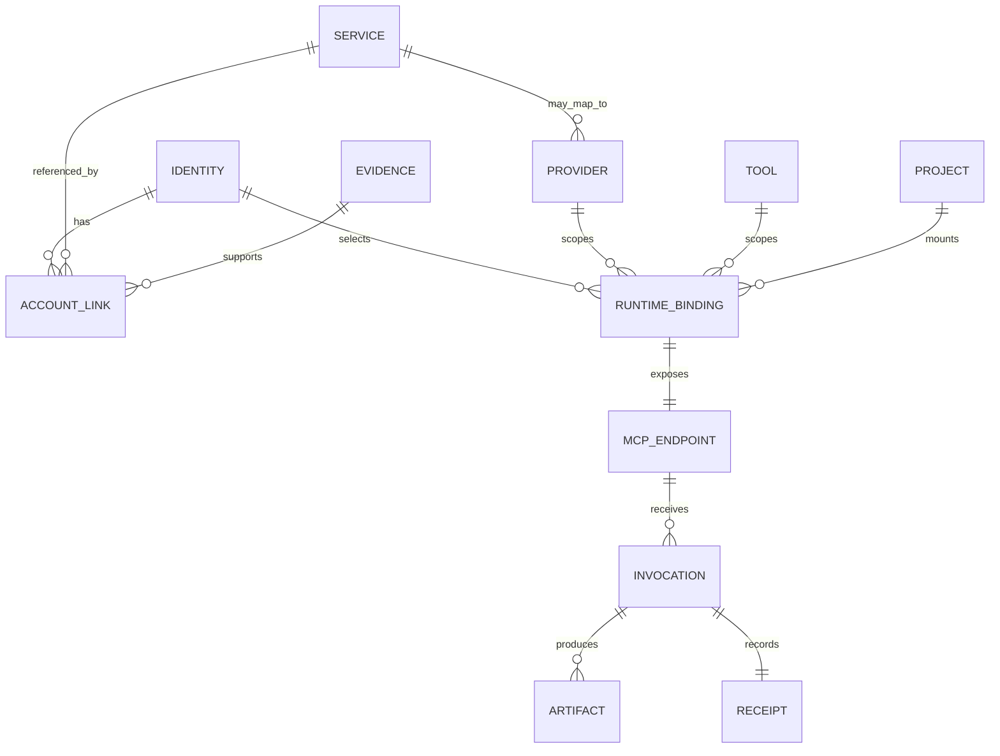

# Account Runtime architecture

## Scope and composition

The standard owns the portable data boundary between account observation and
an isolated provider-tool runtime. It composes existing standards instead of
redefining them:

- `wellmanifest/dsl` supplies closed-schema and constrained-generation rules;
- POA supplies typed process, plan, external authority and receipt semantics;
- `wellmanifest/deployment` governs deployment of inventory, hub and runtime
  services, not the account graph itself.

```mermaid
flowchart LR
    Stores[Browser CLI and vault metadata] --> Observe[Secret-discarding observer]
    Observe --> Graph[Account graph snapshot]
    Graph --> Review[Evidence and inference review]
    Review --> Binding[Account runtime binding]
    Binding --> Probe[Install auth endpoint project probes]
    Probe --> Ready{Verified ready?}
    Ready -->|no| Init[Initialization or reauthentication]
    Ready -->|yes| Plan[POA plan]
    Plan --> Grant[External exact grant]
    Grant --> MCP[Account/provider/tool MCP endpoint]
    MCP --> Runtime[Isolated persistent runtime]
    Runtime --> Artifact[Versioned artifact]
    Artifact --> Receipt[Secret-free receipt]
```

## Normative invariants

1. Observation MUST keep a fact, an inference and provider verification as
   different link states. A browser login entry proves only an origin and an
   account handle; it does not prove ownership, entitlement or a live session.
2. Passwords, tokens, cookies, private keys and decrypted secret values MUST be
   discarded before graph persistence. Evidence contains a digest and opaque
   source reference only.
3. Email handles are restricted inventory data. They MAY appear in an
   access-controlled graph projection, but MUST NOT appear in runtime requests,
   URLs, command arguments, logs, artifact receipts or MCP endpoint paths.
4. `installed_unverified`, `profile_present` and
   `available_auth_unverified` MUST NOT be displayed as `ready`.
5. A binding is `ready` only when installation, authentication, endpoint and
   project probes are all verified/current. Readiness expires with its probes.
6. One runtime profile belongs to one account identity. Sharing a browser
   profile or provider token between account bindings is non-conforming.
7. Persistent profile volumes MUST be paired with verification after restart;
   persistence alone does not prove a valid session.
8. MCP endpoints are scoped to exactly one account, provider and tool. The
   input is the schema+GBNF intersection; raw shell, argv, stdin, environment,
   credential values and transport overrides are forbidden.
9. KVM/noVNC control exposes a bounded action catalogue. Clipboard exchange is
   disabled or brokered as text with size/type policy; it is never an implicit
   bidirectional host channel.
10. The DSL, container and MCP transport cannot mint grants. Execution requires
    an external intent and single-use exact-plan authority.
11. Query inputs and outputs are artifact references. Receipts contain hashes,
    evidence references and outcomes, never inline prompts or model output.
12. `executed_unverified`, `auth_unverified`, initialization and denial are
    terminal honest outcomes; none may be rewritten as success.

## Graph model

A generic service origin remains useful even when it cannot be classified as
an AI provider. Implementations MUST retain that service and the evidence link
rather than dropping the account because a provider catalogue has no match.

## Trust boundaries

| Boundary | Owns | Must reject |
| --- | --- | --- |
| Observer | Secret-discarding metadata extraction | Secret persistence, opaque success without evidence |
| Graph | Identities, services, typed links and evidence | Provider-only loss of generic services |
| Reviewer/resolver | Inference and verified provider mapping | Name-only ownership or readiness claims |
| Runtime binding | Exact identity/provider/tool/project/container endpoint | Shared profile, raw host path, stale graph digest |
| Runtime probe | Current installation/auth/endpoint/project state | `profile_present` as authenticated |
| External authority | Intent and exact single-use plan grant | Grant minted by LLM, MCP or container |
| MCP/runtime | Bounded execution and artifact production | Raw shell/argv, foreign account/tool, inline credentials |
| Receipt store | Redacted hashes, refs and terminal outcome | Email, prompt, output or secret material |

## Operational evidence generalized

On 2026-08-12 the reference implementation exposed hundreds of browser-derived
identities but provider links for only a small subset, while its runtime Hub
exposed more than one hundred scoped MCP endpoints whose CLI authentication was
still unverified. These observations are non-normative evidence for two rules:
retain generic service links, and never equate endpoint availability with
authenticated readiness.
