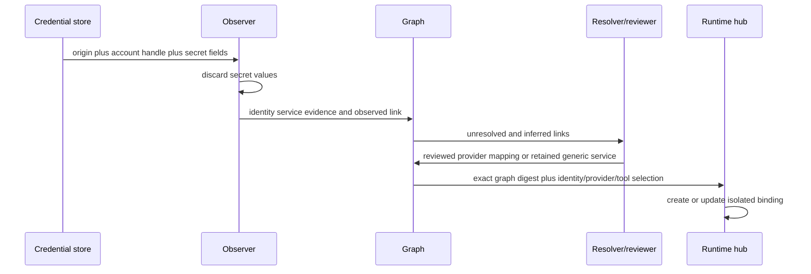
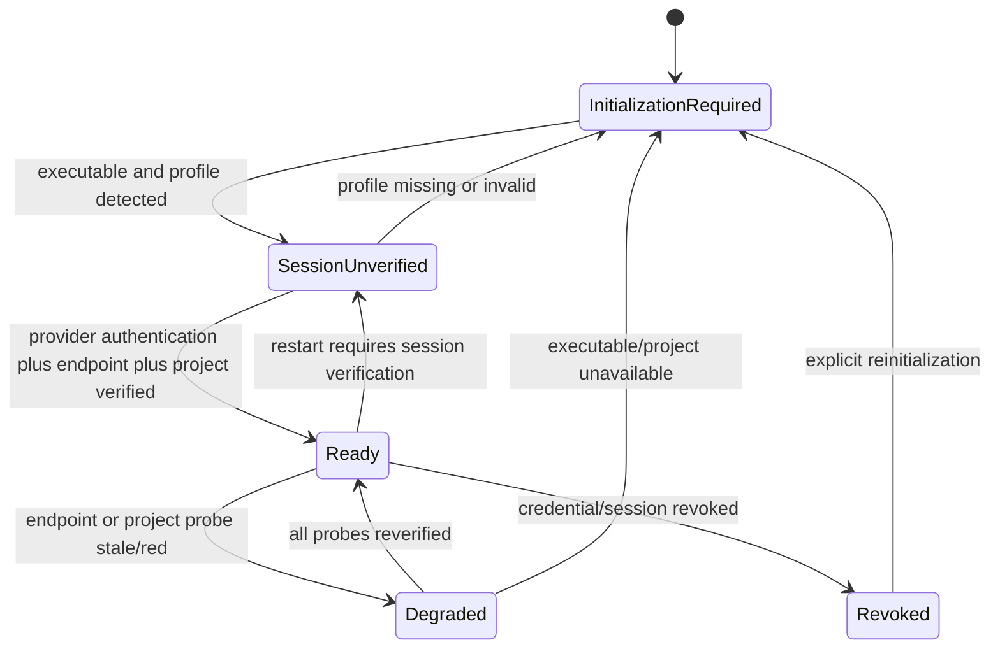
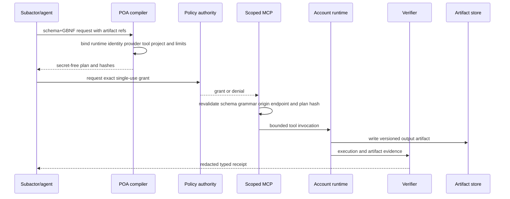
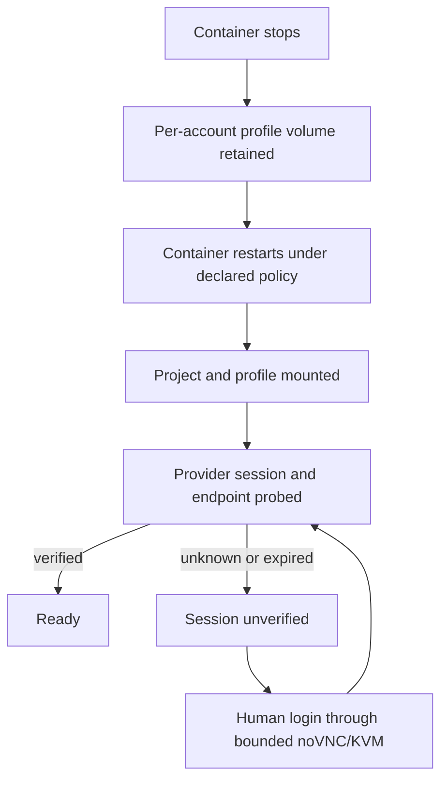

# Account Runtime logic flow

## Observation and resolution



Deleting an unclassified service is not a resolution. The graph preserves it
as `generic-service` or `unknown` until evidence supports a provider mapping.

## Readiness state machine



The derived `ready` predicate is:

```text
installation == available
AND authentication == verified
AND endpoint == verified
AND project IN [mounted_read_only, mounted_read_write]
AND every observation is current under local policy
```

No softer signal can compensate for a red or unknown predicate.

## Invocation path



An invocation that needs a different account, provider, tool, project, prompt,
input, limit or output contract is a new plan and needs a fresh grant.

## Restart and session persistence



The profile volume is necessary for persistence but insufficient for readiness.
An implementation MUST keep the runtime non-ready until post-restart probes
confirm the provider session.

## Failure routing

| Failure | Required outcome | Next safe action |
| --- | --- | --- |
| Unknown service classification | retain observed link | review or add mapping evidence |
| Executable missing | `initialization_required` | install through governed image update |
| Profile only detected | `auth_unverified` | provider verification or human login |
| Foreign endpoint/identity/tool | `denied` | create a new exact plan |
| Schema/GBNF mismatch | `denied` | regenerate a conforming request |
| Runtime mutation but output unverified | `executed_unverified` | preserve evidence and escalate/retry under new plan |
| Restart invalidates session | `auth_unverified` | reauthenticate; never reuse readiness claim |
| Clipboard policy violation | `denied` | use bounded artifact/text broker |

Every terminal branch emits a receipt, including denial and initialization.
