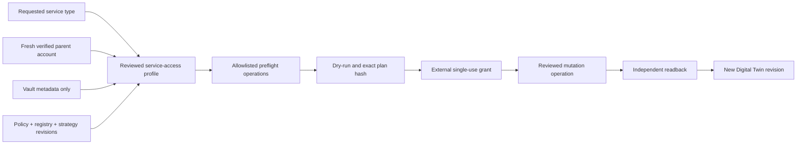

# Account-derived service access

```dsl
DOCUMENT SERVICE_ACCESS
VERSION 1
LANGUAGE EN
MODE STRICT
SCHEMA "wellmanifest.service-access-catalog/v1"
HOME "wellmanifest/account-runtime"
SHAPE "domain_pack"
COMPOSES "wellmanifest/auth-lifecycle"
COMPOSES "wellmanifest/authority-lifecycle"
COMPOSES "wellmanifest/twin-lifecycle"
```

## Purpose and ownership

`wellmanifest.service-access-catalog/v1` standardizes the knowledge needed to
answer one question without inventing an account, operation or credential:

> Can an already verified provider account observe or provision this requested
> service, through which reviewed operation, and which independent observation
> must update its Digital Twin?

This is a new document family in the existing `wellmanifest/account-runtime`
pack. It extends that pack because account-runtime already owns the portable
boundary between observed account evidence and account-scoped execution. It
does not alter the immutable `wellmanifest.account-runtime/v1` family.

The neighbouring standards retain their ownership:

| Concern | HOME | Service-access relation |
| --- | --- | --- |
| Authentication and membership binding | `wellmanifest/auth-lifecycle` | consumes a verified account relation |
| Exact grants, leases and revocation | `wellmanifest/authority-lifecycle` | requires an external single-use grant; never mints one |
| Observe/plan/grant/verify stage graph | `wellmanifest/twin-lifecycle` | binds its revisioned readback to the operating Twin |
| Account graph and scoped runtime | `wellmanifest/account-runtime` | owns this catalog family |
| Connector, Vault and Twin services | adopter runtime | resolves references and executes; never HOME in Wellmanifest |

## Closed composition

Each profile closes the reusable relation below. A missing edge is a declared
gap, not permission to guess.



The catalog itself has `acts=false` and `authority=evidence-only`. Operation
references are immutable `operation://.../vN` identifiers. An adopter maps
them to its provider-native API, SSH, subscription, browser or other connector
surface only after resolving the pinned registry and policy revisions.

## Normative invariants

1. A profile MUST require the `account_verified` relation from
   `schema://wellmanifest.dev/account-runtime/v1`, a live observation and a
   current freshness decision. A discovered login, installed client or stored
   profile is insufficient.
2. Credential evidence MUST be metadata-only and target-bound. Passwords,
   tokens, cookies, keys and decrypted values MUST NOT occur in a catalog,
   context projection, URI, log or Twin.
3. Every profile MUST bind versioned policy, registry and strategy references,
   a reviewed connector, declared capabilities and at least one preflight
   operation.
4. An `observe` profile MUST NOT contain a mutation operation, producer,
   produced credential kind, grant request or account-creation path.
5. A `provision` profile MUST bind one immutable mutation operation and use
   two phases: dry-run to an exact plan hash, then apply under an external
   single-use grant. An apply receipt is mandatory.
6. A credential kind MAY be produced only when a reviewed `producerIntentRef`
   exists. The value is generated by the provider operation and delivered to
   the adopter's secret boundary; it is never generated by knowledge or stored
   in the catalog.
7. `accountCreation=provider-child` means a child resource under the verified
   parent account, for example a hosting filesystem user or mailbox. It MUST
   be a provision profile with a reviewed producer and declared output kind.
8. Creation of a primary provider account or tenant is outside v1 and is
   forbidden by `providerAccountCreationAllowed=false`. Subscription inventory
   does not imply subscription-creation capability.
9. Every profile MUST finish with an independent query that updates inventory
   and creates a new Twin revision. An apply response, cached projection or
   model statement is not readback.
10. Every declared service type MUST have at least one profile or an explicit
    gap. A gap and a profile for the same `(provider, service, mode)` tuple are
    contradictory and non-conforming.
11. A Supervisor MAY select only among declared profiles after deterministic
    filtering. It cannot add an operation, create a target or grant authority.
12. Knowledge, policy evaluation and lifecycle approval remain different from
    execution authority. No document in this family can make
    `knowledgeGrantsAuthority` true.

## Child accounts and generated credentials

The standard distinguishes three cases:

| Case | v1 result |
| --- | --- |
| Observe an existing account or subscription | allowed through an observe profile and revisioned Twin readback |
| Generate a credential or provider-child account under a verified parent | allowed through a provision profile, reviewed producer, exact grant and readback |
| Create a new primary provider account or tenant | unsupported; record a gap and route to the owning standard/process |

This distinction permits an adopter to ask an authorized hosting panel to
create a scoped filesystem user while preventing an agent from fabricating a
username/password pair or treating the parent login as permission to create a
new provider tenant.

## Digital Twin semantics

The Twin is the current evidence-backed read model, not a command proxy. A
consumer first observes the parent account and resolves a catalog profile.
After an authorized operation, it runs the profile's independent
`readback.queryOperationRefs`, verifies that the effect is present, updates the
inventory and emits a new revision. Until that revision exists, the requested
service remains unverified even if the provider returned success.

Profiles MUST bind the `service-observe-repair/v1` blueprint from
`wellmanifest/twin-lifecycle`. Its stages correspond to this catalog as
follows:

| Twin lifecycle stage | Service-access evidence |
| --- | --- |
| `observed` | current verified parent-account observation |
| `inventoried` | service and credential metadata refs only |
| `target-bound` | one catalog profile, provider and target binding |
| `preflighted` | all profile preflight operations passed |
| `planned` | immutable operation plus current plan hash |
| `granted` | external grant evaluated for the exact hash; not authority minted by the Twin |
| `verified` | independent readback produced the next Twin revision |

## Gap behavior

An unresolved request returns `knowledge-gap`. Its record identifies the
service type, provider, mode, reason code, required capability and repository
that owns the missing implementation. A runtime MUST NOT substitute a similar
operation, relax the requested mode or construct a provider URI from prose.

Common gap examples are an unreviewed subscription-creation operation,
missing database provisioning, or a TLS action without canonical readback.
Adding support requires a new versioned operation, policy/registry/strategy
binding, profile and conformance evidence.

## Subactor adoption crosswalk

Subactor remains a runtime adopter. Its components map to the neutral standard
without transferring HOME:

| Standard edge | Subactor source |
| --- | --- |
| requested service and profile selection | `subactor/config` service-access projection |
| verified parent-account observation | account inventory / connector live query |
| credential metadata | `subactor/credential-vault` metadata query or lease boundary |
| connector and operation references | connector capability and process-pack registries |
| deterministic candidate selection | `subactor/strategy` plus `subactor/policy` |
| source and ownership discovery | `subactor/registry` and shared Config source index |
| independent readback | provider query plus Subactor Digital Twin revision |
| mutation authority | external policy/grant bound to the exact plan hash |

For example, a Plesk adopter may map a neutral filesystem-child profile to its
reviewed `ftpuser ensure` operation and subscription snapshot queries. That
mapping belongs in Subactor configuration, not in the Wellmanifest standard.
The standard proves the mapping shape and boundaries; it never calls Plesk.

## Diagnostics

| Code | Meaning |
| --- | --- |
| `SVCACCESS-DOC-001` | catalog shape, uniqueness or declared service coverage is invalid |
| `SVCACCESS-REF-001` | a provider, connector, operation, governance or Twin reference is malformed or mutable |
| `SVCACCESS-ACCOUNT-001` | parent-account verification or provider-child creation is unsafe |
| `SVCACCESS-MUTATION-001` | observe contains an effect path or provision lacks exact-plan control/producer evidence |
| `SVCACCESS-READBACK-001` | independent revisioned Twin readback is missing |
| `SVCACCESS-SECRET-001` | credential values or a non-metadata credential channel were present |
| `SVCACCESS-GAP-001` | a service is uncovered or a gap contradicts a declared profile |
| `SVCACCESS-AUTHORITY-001` | knowledge, Supervisor or catalog was allowed to act or mint authority |

`python3 standard/conformance.py --all` validates the neutral example and
proves these fail-closed boundaries through adversarial mutations. The example
is illustrative rather than a provider catalog; concrete mappings are
versioned by each adopter.
